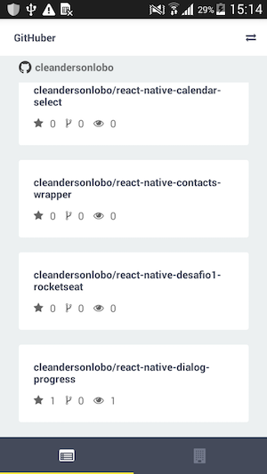
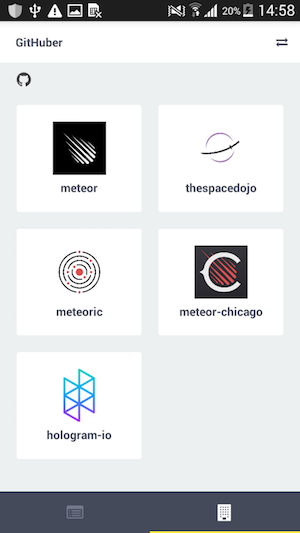

## react-native-sampleapp-githuber
Example application to list repositories and organizations of a Github user.

### Requirements

- [Node](https://nodejs.org) 4.x or better
- [React Native](http://facebook.github.io/react-native/docs/getting-started.html) for development
- [Xcode](https://developer.apple.com/xcode/) for iOS development (optional)
- [Android SDK](https://developer.android.com/sdk/) for Android development (optional)
- [Android Lollipop](https://www.android.com/versions/lollipop-5-0/) or better for Android device testing (optional)

### Installation

Clone repository:
```sh
git clone git@github.com:cleandersonlobo/react-native-sampleapp-githuber.git
```
After run:
```sh
npm install
```

## Running

Once dependencies are installed, run the starter kit with:

```sh
npm start or react-native start
```

This will start the React Packager.

### iOS

Open `ios/AwesomeProject.xcodeproj` in Xcode, build and run the project (⌘+R).

### Android

For android development use the following:

```sh
react-native run-android
```

### Screenshots




## Thanks 

## License

MIT